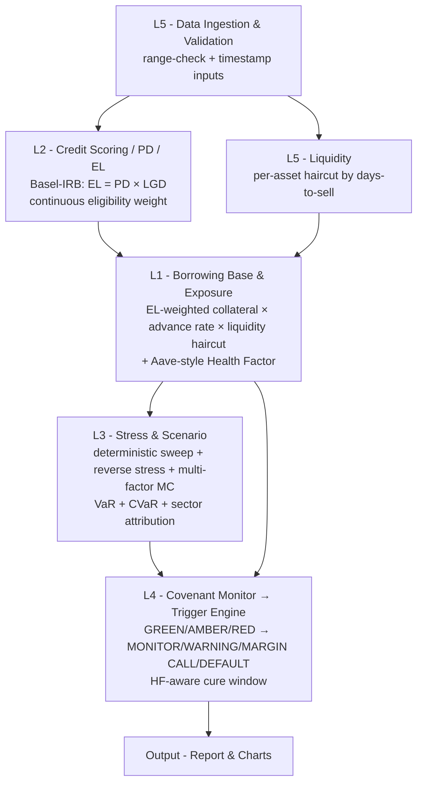

# Architecture & Design Rationale

A `figures/architecture.png` / `figures/architecture.svg` diagram is
included for slides. The same flow in text (renders on GitHub):

## Why it is built this way (the design thinking)

This is a **融合议题** (a fusion problem): there is no off-the-shelf
"fund finance" library, so the system is decomposed into **6 reusable
sub-problems**, each solved with a mature open-source pattern, then
re-assembled. That decomposition *is* the engineering contribution.

| Layer | Sub-problem | Borrowed pattern | Engineering principle |
|---|---|---|---|
| **L5** Data ingestion | trust the inputs | collateral-mgmt systems: timely, validated, multi-source data | sensor layer: range-check + timestamp |
| **L2** Credit scoring / EL | how good is the collateral? | Basel III IRB: EL = PD × LGD, continuous risk weight | derating curve, no cliff functions in a main loop |
| **L5** Liquidity | can we actually sell it? | haircut-by-liquidity in collateral management | bigger margin for slow/noisy signals |
| **L1** Borrowing base + Health Factor | how much can we safely lend / how far from forced action? | Aave / Compound DeFi liquidation engines | plant state + safety factor + stability margin |
| **L3** Stress + reverse + MC | when do we break, where, how often? | Basel SR 11-7 reverse stress + MSCI Barra factor MC + pyfolio VaR/CVaR | per-loop stability ranking + coupled-disturbance noise analysis |
| **L4** Covenants + triggers | what do we do about it? | rule engine with hardstops; DeFi 2-stage liquidation | protective relay: alarm band + time-graded trip |
| **arch** | keep it modular | FinancePy: data / models / products separation | modular subsystems, each unit-testable |

### Six design choices you can defend

1. **Separation of concerns.** Each layer is an independent module with
   a narrow interface, so the valuation source, the PD model, or the
   covenant set can be swapped without touching the rest.
2. **Conservative by construction.** The lendable amount is `min(borrowing
   base, hard limit)`; collateral is discounted by both EL weight and
   liquidity factor; the Health Factor applies a further 85% safety
   margin before declaring "safely usable". Always round toward safety.
3. **No discontinuous gains in the main loop.** v1's binary
   `is_eligible` cliff at PD ≤ 3% is replaced by a continuous EL-weight
   function. Step changes in eligibility cause step changes in borrowing
   base — equivalent of injecting a square wave into a feedback loop.
4. **State vs disturbance are separate.** L1 computes today's state; L3
   injects shocks and re-runs the same machinery. Three independent
   stress views (deterministic / reverse-per-covenant / multi-factor MC)
   stress different axes — like running step, ramp, and noise inputs
   through the same plant.
5. **Defence in depth.** Several independent covenants run in parallel
   (BB headroom, HF, utilization, LTV, asset & sector concentration,
   liquidity coverage, min #assets), so one distorted input cannot
   single-handedly drive an action. The trigger engine ranks them.
6. **Graduated, time-graded response.** GREEN → AMBER → RED, then a
   cure period that **shrinks as Health Factor deteriorates** (full
   window at HF ≥ 1.0, half at HF ≥ 0.8, zero below). Protective-relay
   coordination: a fault deeper into the protected zone trips faster.

## What the sample run shows (talking points)

With the synthetic `Project Alpha Fund` and a NAV facility (20% advance
rate, drawn 30):

- **L2** — EL weighting: Family Office D (NR, PD 10%) is now counted at
  50% rather than excluded outright. Endowment C (BBB, PD 2%) is counted
  at 91%. Continuous, not a cliff.
- **L5 liquidity haircut** — cuts the borrowing base from NAV 190 to
  effective BB **33.75** (illiquid assets count for less).
- **L1 Health Factor** — `(33.75 × 0.85) / 30 = 0.956`. **Below 1.0**,
  meaning the safe slice of the borrowing base is already smaller than
  the drawn amount. This is the single number a banker (or DeFi
  protocol) acts on.
- **L4** — multiple covenants trip; the Health Factor going RED triggers
  **MARGIN CALL** today, with an HF-aware cure window of 5 days (half
  the negotiated 10).
- **L3 deterministic** — first breach at a NAV drop of ~12% causes a
  borrowing-base deficiency, well before the LTV covenant (~37%).
- **L3 reverse stress (new)** — ranks all 8 covenants by distance-to-breach:
  HF binds today, BB and utilization follow at ~11%, LTV is **25
  percentage points further** at 37%. Liquidity coverage is the safest
  at 81%. Asset / sector concentration ratios are invariant to a uniform
  NAV haircut, so they show as "never within tested range" — the engine
  correctly identifies that they need a *single-sector* shock, not a
  *whole-portfolio* shock, to break.
- **L3 multi-factor MC (new)** — with sector-level vols and an
  MSCI-Barra-style correlation matrix over a 6-month horizon:
  - P(LTV breach) drops to ~0% (vs 22% in v1's single-shock model),
    because sector diversification is now real instead of being assumed
    away.
  - **CVaR(99) of LTV ≈ 22.1%**, very close to the 25% covenant cap —
    so the tail still flirts with breach even if the central case is
    safe. This is the right metric for a Risk Committee report; v1's
    p50/p95/p99 hid it.
  - Sector attribution: when a breach does occur it is driven almost
    entirely by Technology (avg drawdown 49%) and Financials (41%).
    This connects directly to the *sub-sector decomposition* methodology
    presented in the companion UniCredit deliverable.

> All thresholds (advance rates, EL cap, LGDs, covenant limits, sector
> vols and correlations) are illustrative defaults, not market standards;
> in a real deal they are negotiated per transaction.

## Engineering ↔ fund-finance isomorphism (the deeper point)

The reason a fund-finance facility monitor maps cleanly onto a control
system is not aesthetic — it is structural. Both are **multi-loop
feedback systems with protective interlocks under uncertain inputs**:

| Fund-finance concept | EE concept | Same problem being solved |
|---|---|---|
| Advance rate | Derating factor | Margin against operating point |
| EL weight (PD × LGD) | Continuous gain function | Avoid step changes in main loop |
| Liquidity haircut | Bandwidth-limited signal weighting | Discount slow / noisy inputs |
| Borrowing base | Plant capacity estimate | Current safe operating envelope |
| Health Factor | Stability margin | Single normalised distance to instability |
| Covenant alarm band (AMBER) | Pre-trip alarm threshold | Detect before fault |
| Covenant breach (RED) | Trip threshold | Open the breaker |
| Cure period | Time-graded trip delay | Avoid nuisance trips on transients |
| HF-aware cure (shorter when worse) | Inverse-time overcurrent relay | Faster trip closer to fault |
| Per-covenant reverse stress | Per-loop stability margin | Identify the weakest loop |
| Multi-factor MC sector attribution | Cross-PSD noise analysis | Decompose disturbance by source |
| Margin call → default (2-stage) | Two-stage breaker (alarm → trip) | Graduated protection |
| LP concentration cap | Single-point-failure tolerance | Avoid dependence on one source |

This is the value proposition: not "an EE who learned finance," but "a
fund-finance product whose internal structure happens to be the control
system EE engineers solve every day."
